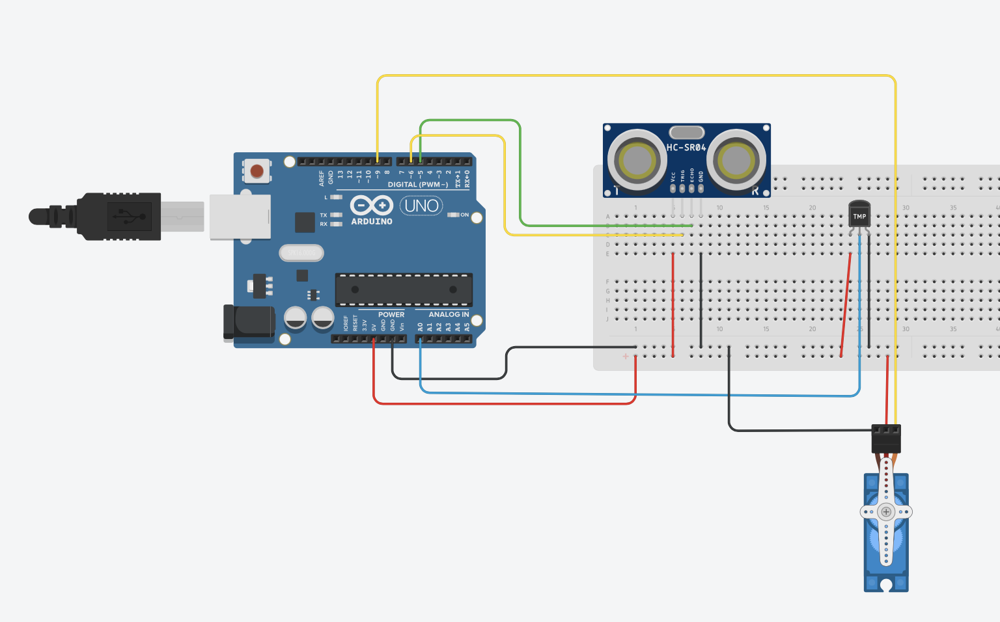

# a2-sensores-practica-2
Segunda actividad práctica del módulo de sensores de la asignatura Introducción al Diseño de Ingeniería.

## Librería LCD I2C
Para utilizar la pantalla LCD a través de I2C debe instalar una librería que puede descargar [aquí](https://codeload.github.com/marcoschwartz/LiquidCrystal_I2C/zip/master). Luego, podrá instalarla a través del IDE de Arduino dirigiéndose a: Programa -> Incluir Librería -> Añadir librería .ZIP donde deberá seleccionar la carpeta descargada.

## Conexión LCD I2C
- GND: GND
- VCC: 5V
- SDA: A4
- SCL: A5
